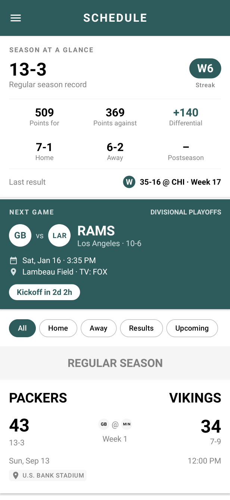
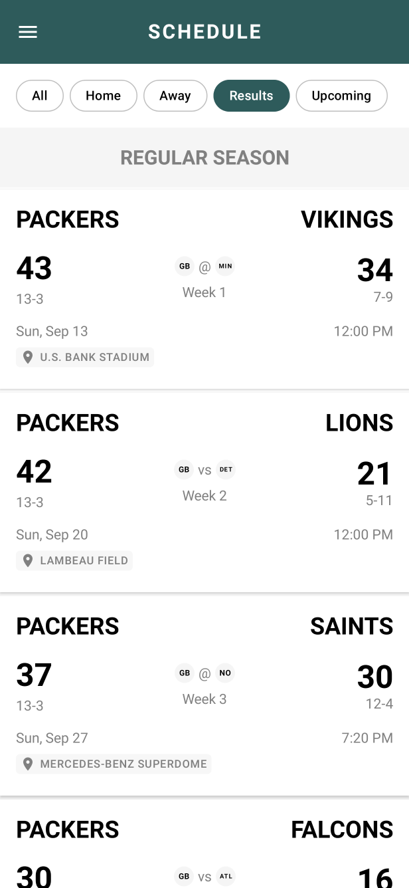
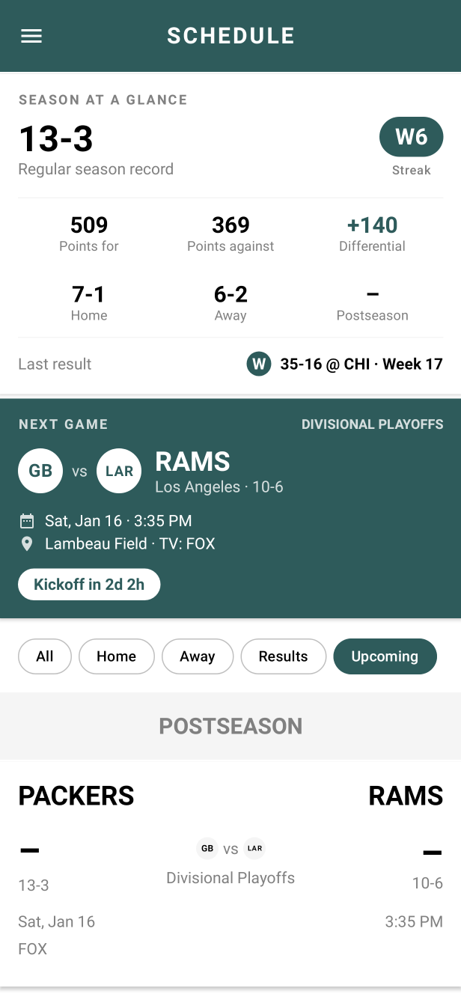
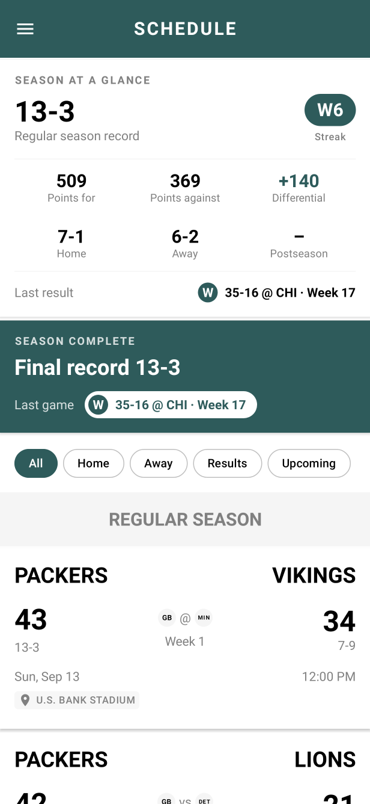
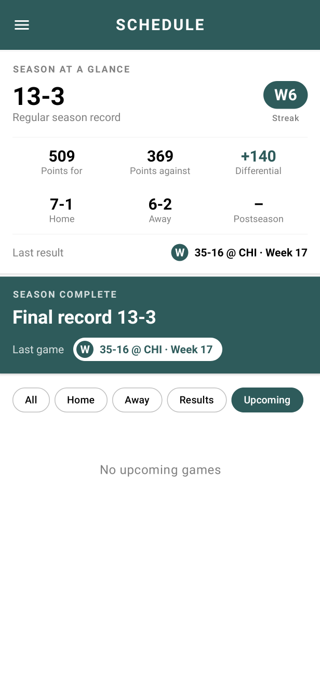
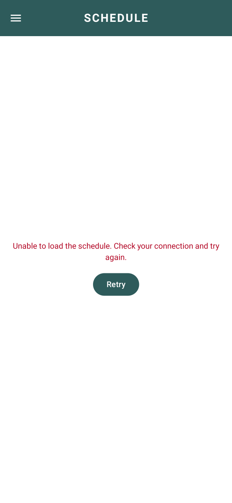
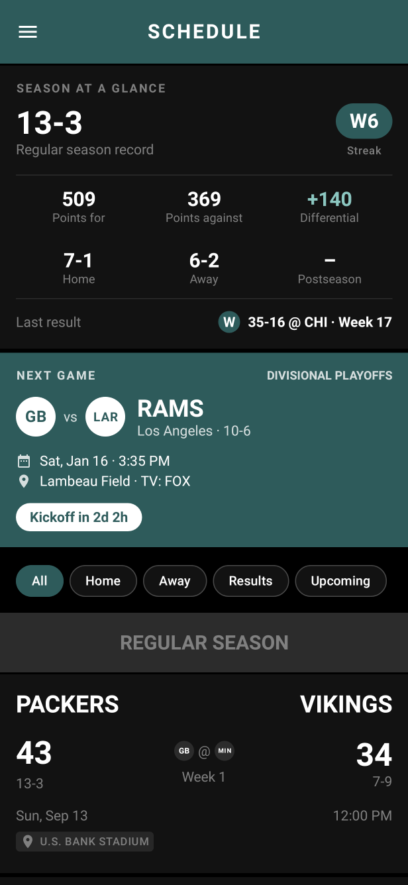

# Sports Schedule

An Android app that shows an NFL team's season schedule (the Green Bay Packers feed), built with
Kotlin and Jetpack Compose. It lists every game by section (regular season, postseason) with scores,
records, kickoff times, venues and TV, and adds a season summary, a live next-game countdown and
schedule filters on top.

Author: **Eswar Reddy Madhira** ([github.com/iEswar23](https://github.com/iEswar23))

## Screenshots

| Schedule | Results filter |
|---|---|
|  |  |
| **Upcoming filter + next game countdown** | **Season complete** |
|  |  |
| **No upcoming games** | **Error state** |
|  |  |
| **Dark theme** | |
|  | |

The screenshots are rendered on the JVM from the real composables and ViewModel with a recorded copy
of the feed and a fixed clock (see [Screenshot tests](#screenshot-tests)). Network access is disabled
while recording, so team logos show their tricode placeholder badges.

## Features

- **Schedule list**: games grouped into sections, with team names, scores, records, logos, week,
  local date and time, and TV network or venue. My team is always on the left, with "vs" for home
  games and "@" for away games; games not played yet show "–" instead of a score. Bye weeks get
  their own card.
- **Pull to refresh**, plus loading, error (with Retry) and empty states.
- **Season at a glance** *(new)*: a summary card at the top of the list.
- **Filters and Next game countdown** *(new)*: filter chips and a highlighted next-game card.
- Light and dark themes.

### Season at a glance

Computed by `SeasonStatsCalculator`, a pure Kotlin class in the domain layer:

- Regular-season record `W-L`, shown as `W-L-T` only when there is at least one tie.
- Points for, points against and point differential (`+140`, `-12`).
- Home and away records.
- Current streak, e.g. `W6`, and the last result, e.g. `W 35-16 @ CHI · Week 17`.
- Postseason record, shown separately.

Rules:

- Only final games count; the result is decided by the scores (my team vs opponent), so equal
  scores are a tie.
- Scheduled games, bye weeks and preseason games are ignored.
- A final game with a missing, blank, negative or non-numeric score is skipped and the card notes
  how many were skipped.
- Record, home/away splits and points cover the **regular season only**. Postseason games are
  tallied in their own record. Streak and last result follow regular season and postseason games
  together, in feed order.

For the recorded 2020 feed this gives 13-3, 509 points for, 369 against (+140), 7-1 at home,
6-2 away, a W6 streak and a last result of W 35-16 at Chicago in week 17.

### Filters and Next game

- Filter chips: **All · Home · Away · Results · Upcoming**, applied by the pure `ScheduleFilter`.
  Bye weeks only appear under All, sections left empty are hidden, and an empty result shows a
  message such as "No upcoming games".
- Upcoming means not final, not a bye, and either without a kickoff time yet or kicked off less
  than four hours ago.
- The selected filter is stored in `SavedStateHandle`, so it survives configuration changes and
  process death.
- The **Next game** card (`NextGameFinder`) shows the opponent, local date and time, venue, TV and a
  countdown such as "Kickoff in 2d 2h", "Kickoff in 4h 12m" or "Kickoff in 45m". From kickoff until
  four hours later (while the game is not final) it shows "LIVE NOW".
- When every game is in the past the card switches to **Season complete** with the final record
  and the last game. The bundled feed is the 2020 season, so this is what the app shows today.
- Time comes from an injected `java.time.Clock` (provided by Koin). The ViewModel re-reads it every
  30 seconds while the screen is visible, and tests use fixed clocks.

## Architecture

MVVM with a small domain layer. Business rules are plain Kotlin with no Android dependencies, so
they are unit tested on the JVM.

```
 ┌────────────────────────── UI (Jetpack Compose, Material 3) ──────────────────────────┐
 │ ScheduleScreen ─ SeasonAtAGlanceCard · NextGameCard · ScheduleFilterRow ·            │
 │                  ScheduleItemCard · ByeWeekCard · TeamLogo (Coil + tricode fallback) │
 └──────────────────────────────────────────▲───────────────────────────────────────────┘
                                            │ StateFlow<ScheduleUiState>, isRefreshing
 ┌──────────────────────────────────────────┴───────────────────────────────────────────┐
 │ ScheduleViewModel                                                                    │
 │   combine(load state, selected filter [SavedStateHandle], clock ticks [Clock])       │
 └────────▲──────────────────────────────────────────────────────▲──────────────────────┘
          │ Flow<Result<ScheduleDomain>>                          │ pure functions
 ┌────────┴─────────────────────────┐   ┌─────────────────────────┴────────────────────────┐
 │ Data                             │   │ Domain                                           │
 │ ScheduleRepositoryImpl           │   │ ScheduleRepository (interface), models           │
 │ ScheduleApi (Retrofit)           │   │ SeasonStatsCalculator → SeasonStats              │
 │ DTOs (kotlinx.serialization)     │   │ ScheduleFilter, GameTiming                       │
 │ ScheduleMapper (DTO → domain,    │   │ NextGameFinder → NextGameState                   │
 │   kickoff Instant, season phase) │   │                                                  │
 └──────────────────────────────────┘   └──────────────────────────────────────────────────┘

 DI: Koin (appModule) provides Retrofit/ScheduleApi, the repository, Clock and the ViewModel.
```

Package layout (`com.sports.assessment`):

| Package | Contents |
|---|---|
| `data.remote` | `ScheduleApi`, DTOs, shared `ScheduleJson` configuration |
| `data.mapper` | DTO to domain mapping, including kickoff `Instant` and `SeasonPhase` |
| `data.repository` | `ScheduleRepositoryImpl` |
| `domain.model` | `ScheduleDomain`, `GameDomain`, `TeamDomain`, `GameType`, `SeasonPhase` |
| `domain.stats` | `SeasonStatsCalculator`, `SeasonStats`, `Record`, `Streak` |
| `domain.schedule` | `ScheduleFilter`, `GameTiming`, `NextGameFinder` |
| `presentation.schedule` | `ScheduleViewModel`, `ScheduleUiState`, `ScheduleScreen`, countdown formatting |
| `ui.components`, `ui.theme` | Composables and theme |
| `di` | Koin module |

## Tech stack

- Kotlin 2.0.21, Coroutines and Flow
- Jetpack Compose (BOM 2024.11.00), Material 3, `collectAsStateWithLifecycle`
- AndroidX ViewModel with `SavedStateHandle`
- Koin 4.0.0 for dependency injection
- Retrofit 2.11.0, OkHttp 4.12.0, kotlinx.serialization 1.7.3
- Coil 2.7.0 for team logos
- `java.time` with core library desugaring (minSdk 21)
- Tests: JUnit 4, kotlinx-coroutines-test, Robolectric 4.14.1, Roborazzi 1.32.2, Compose UI test
- Build: Gradle 9.1.0 wrapper, Android Gradle Plugin 8.7.2, compileSdk / targetSdk 36, minSdk 21

## Running

Open the project in Android Studio and run the `app` configuration, or build from the command line:

```bash
./gradlew assembleDebug
```

`local.properties` (git-ignored) must point `sdk.dir` at an Android SDK with platform 36 installed.
If `gradlew` is not executable on your machine, run it as `sh gradlew <task>`.

## Tests

```bash
./gradlew testDebugUnitTest
```

JVM unit tests cover:

- `SeasonStatsCalculatorTest`: the recorded feed, ties, skipped scores, byes, preseason, postseason
  and streak rules.
- `ScheduleFilterTest`: every filter, hidden empty sections, bye weeks, the upcoming time window.
- `NextGameFinderTest`: upcoming, live, season complete and unavailable states.
- `ScheduleFormattersTest`: countdown text, point differential and game card score formatting.
- `ScheduleMapperTest`: parsing `app/src/test/resources/schedule.json` (a recorded copy of the feed)
  through the real mapper.
- `ScheduleViewModelTest`: loading, empty, error, retry, pull to refresh, filter persistence in
  `SavedStateHandle`, and the countdown ticking with a controllable clock.

### Screenshot tests

`ScheduleScreenshotTest` renders `ScheduleScreen` with the real `ScheduleViewModel`, a fake
repository serving the recorded feed and a fixed `Clock`, using Robolectric native graphics on a
Pixel 7-sized configuration. To re-record the images in `docs/screenshots/`:

```bash
./gradlew recordRoborazziDebug
```

A plain `testDebugUnitTest` run still executes every screenshot scenario but does not write images.

## Data source

The schedule is loaded from a public sample feed:
`http://files.yinzcam.com.s3.amazonaws.com/iOS/interviews/ScheduleExercise/schedule.json`

It contains the Green Bay Packers' 2020 season (16 regular-season results, a bye in week 5 and the
Divisional Playoff game against the Rams, which the feed lists as scheduled). Team logos are loaded
from `s3.amazonaws.com/yc-app-resources`. The app is not affiliated with the NFL or any team.
